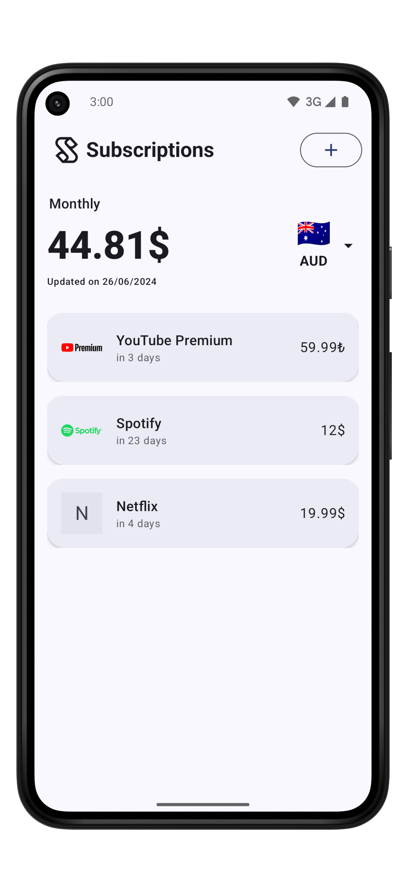
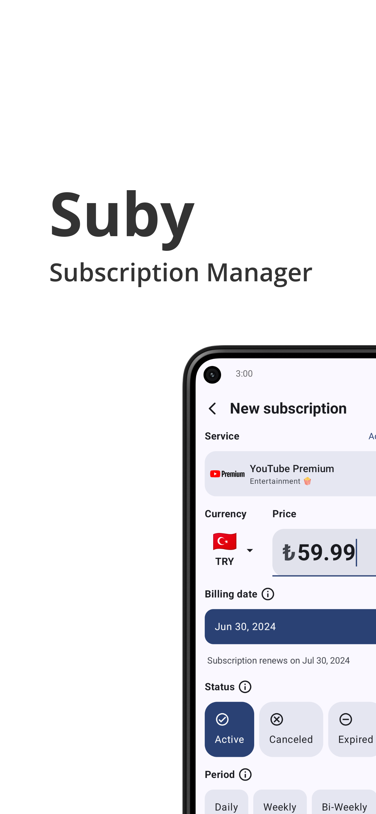
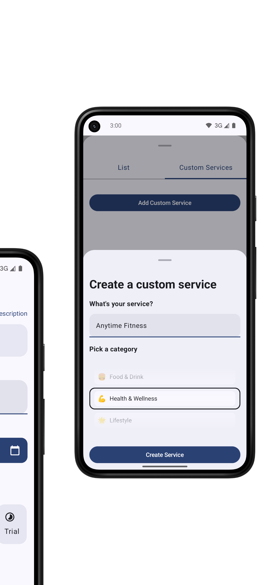
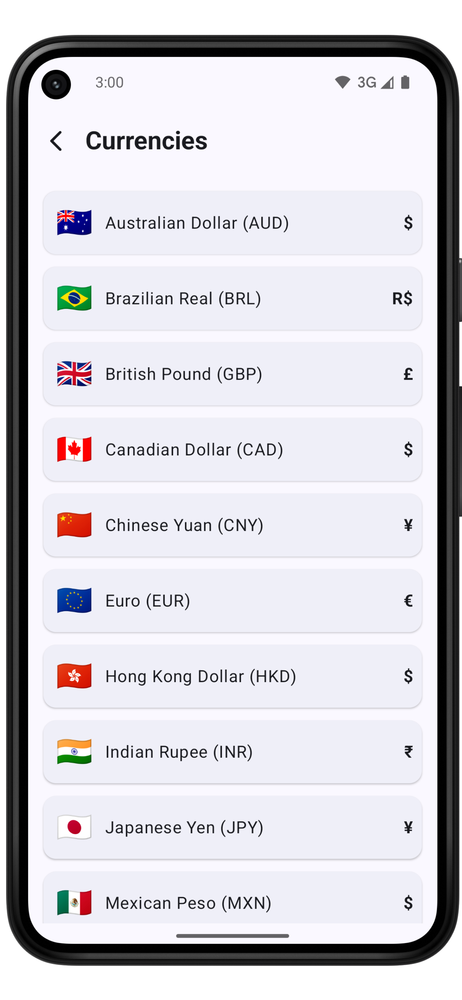

# Suby: Subscription Manager (Beta)

Suby (beta) is designed to help you effortlessly manage all your subscriptions in one place.

## Key Features

- **Choose from a list of services or add your own custom subscriptions**
- **Enter currency, status, billing period, and billing date for each subscription**
- **See your total subscription costs in your main currency for the selected period (day, week, month)**
- **Accurate totals with seamless currency conversions**

## Why Suby?

- **Simple, clean, and intuitive design**
- **Supports custom services to fit your needs**
- **Clear tracking to ensure you never miss a payment**

Simplify your life and take control of your subscriptions with Suby.

## Screenshots

  
  
  
  
  

## Installation

To install Suby, download it from the [Google Play Store](https://play.google.com/store/apps/details?id=com.merkost.suby).

## Feedback

We are currently in beta and would love to hear your feedback! Please reach out to us with any suggestions or issues you encounter.

## License

This project is licensed - see the [LICENSE](LICENSE) file for details.

---

Simplify your life and take control of your subscriptions with Suby.
